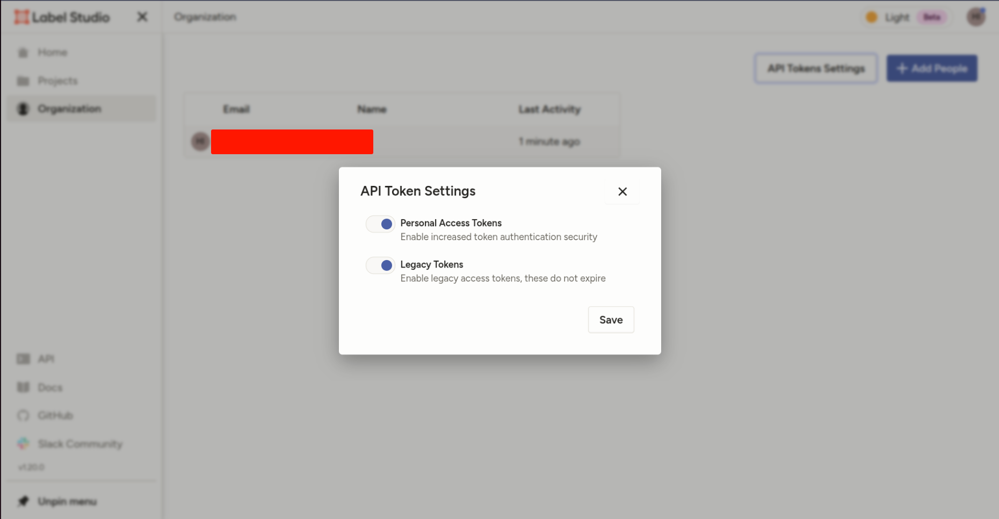
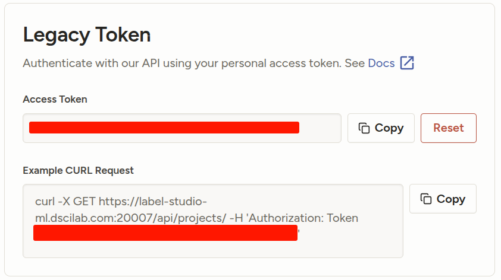

# Label studio deploy

## Usage

- Up docker: `docker-compose up -d`
- Login: [label-studio-ml.dscilab.com:20007/user/login/](https://label-studio-ml.dscilab.com:20007/user/login/)
- Username and password in .env file

## ML Backend

### YOLO

- Enable legacy token
  <div align="center">
    
  </div>

- Get api key in [label-studio-ml.dscilab.com:20007/user/account#legacy-token](https://label-studio-ml.dscilab.com:20007/user/account#legacy-token) and update [ml-backend/yolo/.env](ml-backend/yolo/.env) file
  <div align="center">
    
  </div>
- cd: `cd ml-backend/yolo`
- build: `docker-compose build`
- Up: `docker-compose up -d`
- Test: `curl http://localhost:9090/`
- Copy models into folder [ml-backend/yolo/models](ml-backend/yolo/models)
- Open Label Studio and create a new project with the following labeling config:

```xml
<View>
  <Image name="image" value="$image"/>
  <RectangleLabels name="label" toName="image" model_path="zlfyo9pf.pt" model_score_threshold="0.25">
    <Label value="motorbike" background="#00FF00" predicted_values="motorbike"/>
    <Label value="bus" background="#00FFFF" predicted_values="bus"/>
    <Label value="car" background="#FF0000" predicted_values="car"/>
    <Label value="truck" background="#FFFF00" predicted_values="truck"/>
    <Label value="pedestrian" background="#0000FF" predicted_values="pedestrian"/>
    <Label value="vehicle_others" background="#00FF64" predicted_values="vehicle_others"/>
    <Label value="container_truck" background="#C8C800" predicted_values="container_truck"/>
    <Label value="fire" background="#C81400" predicted_values="fire"/>
    <Label value="smoke" background="#FFC800" predicted_values="smoke"/>
  </RectangleLabels>
</View>
```

- Then from the Model page in the project settings. The default URL is `http://host.docker.internal:9090`
